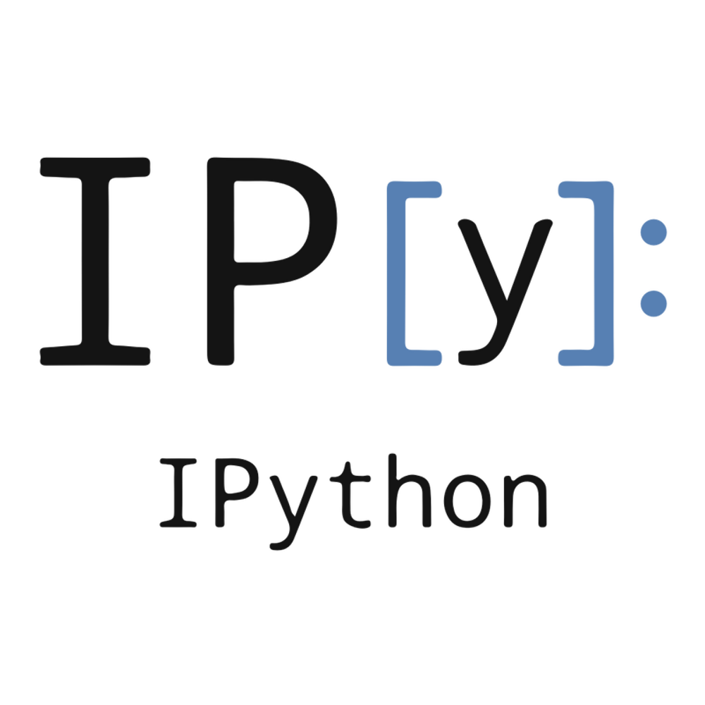
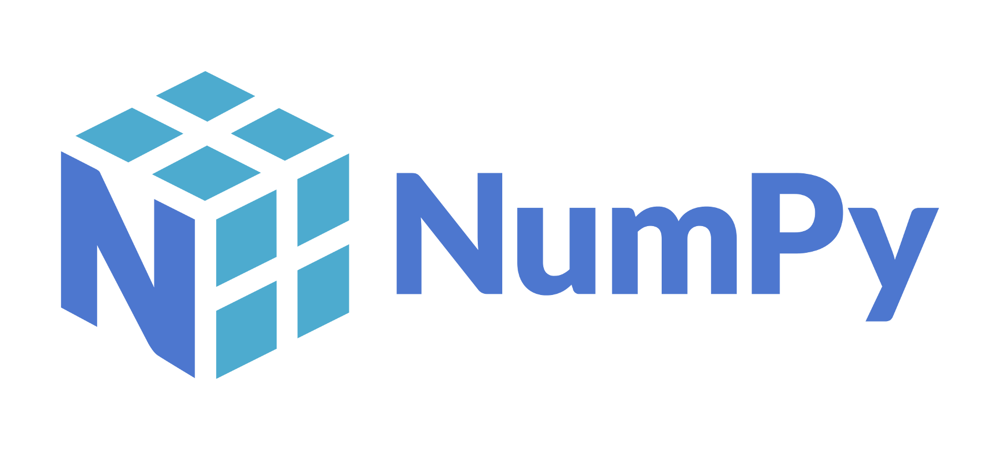
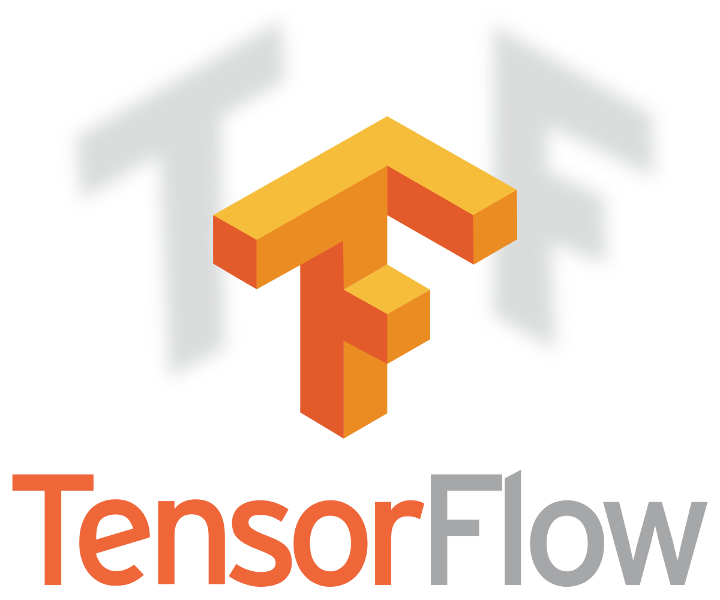
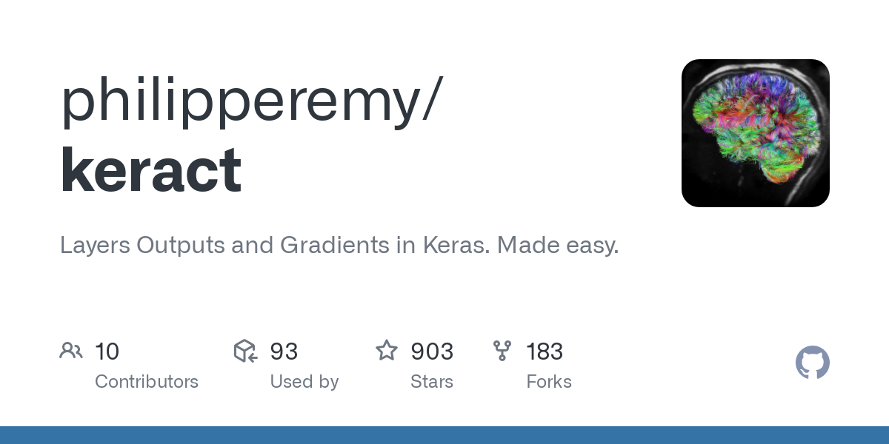

# [Link to my Youtube Video Explaining this whole Notebook](https://www.youtube.com/watch?v=q6E8kGbpaMI&list=PLxqBkZuBynVRyOJs4RWmB_fKlOVe5S8CR&index=27)

## Tech Stack

|<a href="https://www.python.org/">

</a>|<a href="https://jupyter.org/">

</a>|<a href="https://ipython.org/">

</a>|<a href="https://numpy.org/">

</a>|<a href="https://pandas.pydata.org/">

</a>|
|---|---|---|---|---|

|<a href="https://matplotlib.org/">

</a>|<a href="https://opencv.org/">

</a>|<a href="https://albumentations.ai/">

</a>|<a href="https://keras.io/">

</a>|<a href="https://www.tensorflow.org/">

</a>|<a href="https://github.com/philipperemy/keract">

</a>|
|---|---|---|---|---|---|